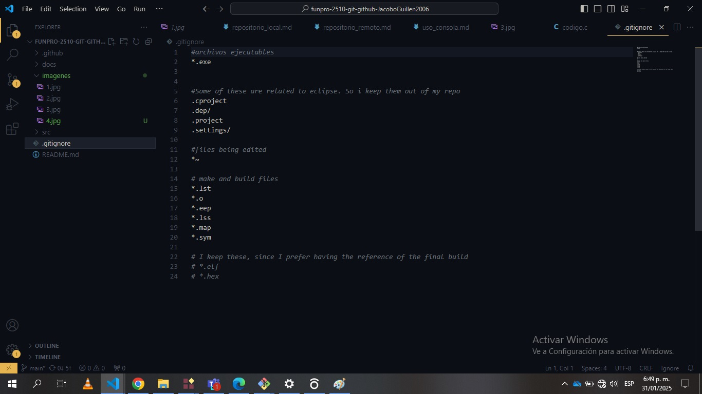

## git ignore

Un archivo .gitignore sirve para especificar qué archivos y directorios deben ser ignorados por Git, el sistema de control de versiones más utilizado en el mundo. Su función principal es evitar que archivos innecesarios o sensibles sean accidentalmente incluidos en el repositorio, manteniendo así el proyecto limpio y seguro.

con gitignore se ignoran archivos temporales, de configuración local, registro, de sistema operativo y de dependencia

a continuación un ejemplo de lo que se puede ver en un archivo git ignore

