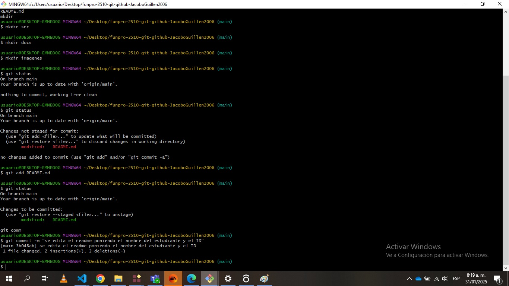

## Repositorio local

se crea una carpeta y en ella abrimos el git bash

```
git init
```
para entrar a un repositorio local

```
git status
```
para reivsar si hemos hecho algun cambio en cualquier archivo del repositorio
```
git add "archivo editado" o git add .
```
git add "archivo editado" para guardar los cambios hechos a un archivos o git add . para guardar cambios a mas de un archivo editado
```
git commit -m "mensaje" 
```
para enviar todos los cambios al repositorio local

