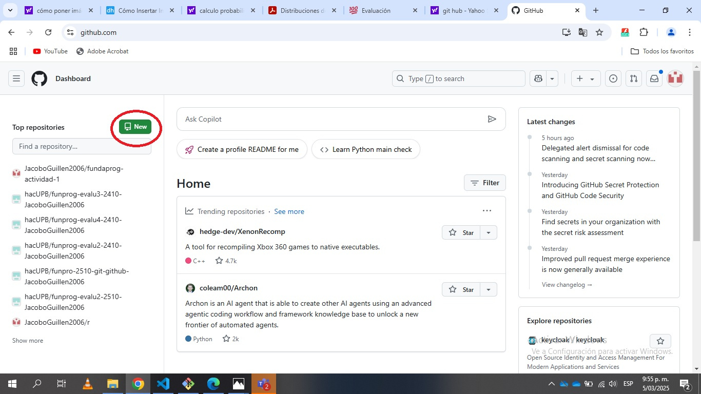
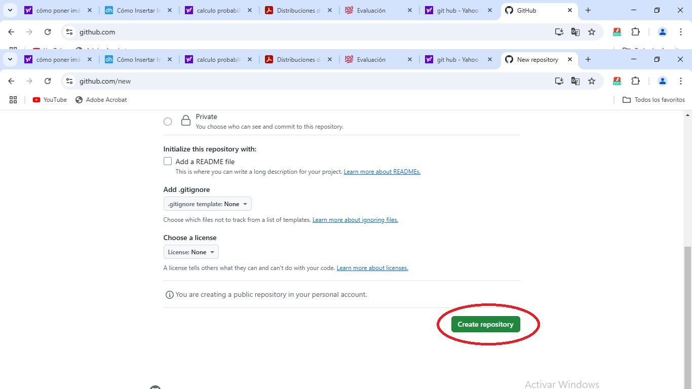
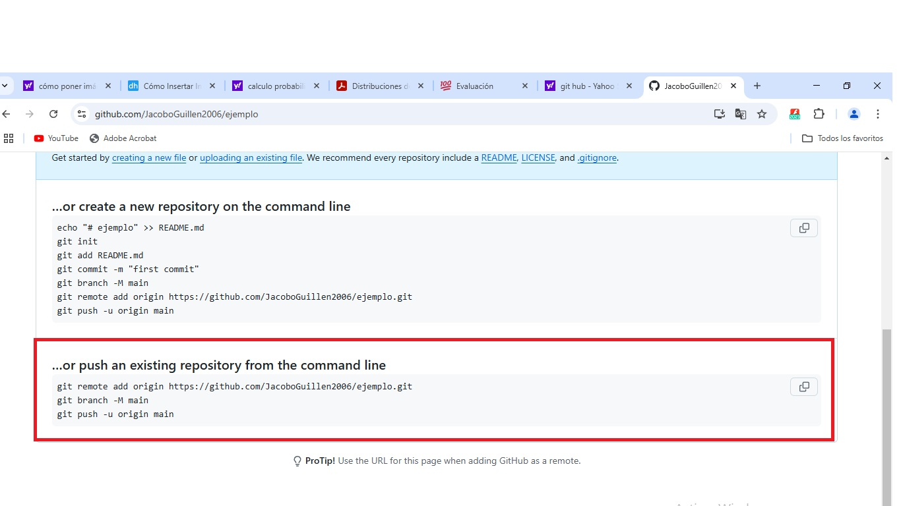

## Repositorio remoto

creamos un repositorio remoto en gitbash de la misma manera en la que se explica en el repositorio local de como se crea un
[repositorio local](repositorio_local.md)

cuando tengamos nuestro repositorio local entramos a git hub y le damos al boton para crear un nuevo repositorio


despues de entrar le damos un nombre a nuestro repositorio


 y le damos al botón de crear repositorio


despues nos daran un comando el cual introduciremos en nuestro repositorio local


```
git remote add origin https://github.com/JacoboGuillen2006/r.git
git branch -M main
git push -u origin main
```
