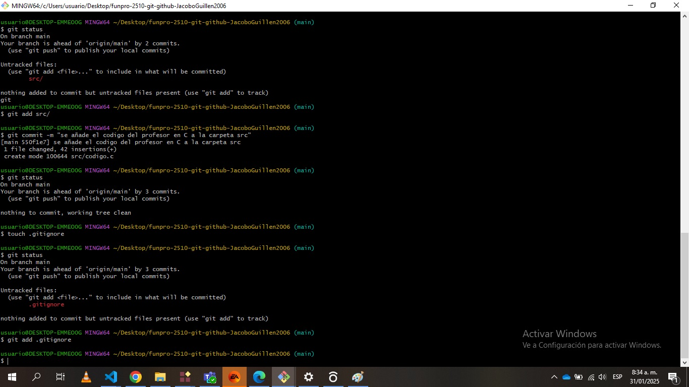
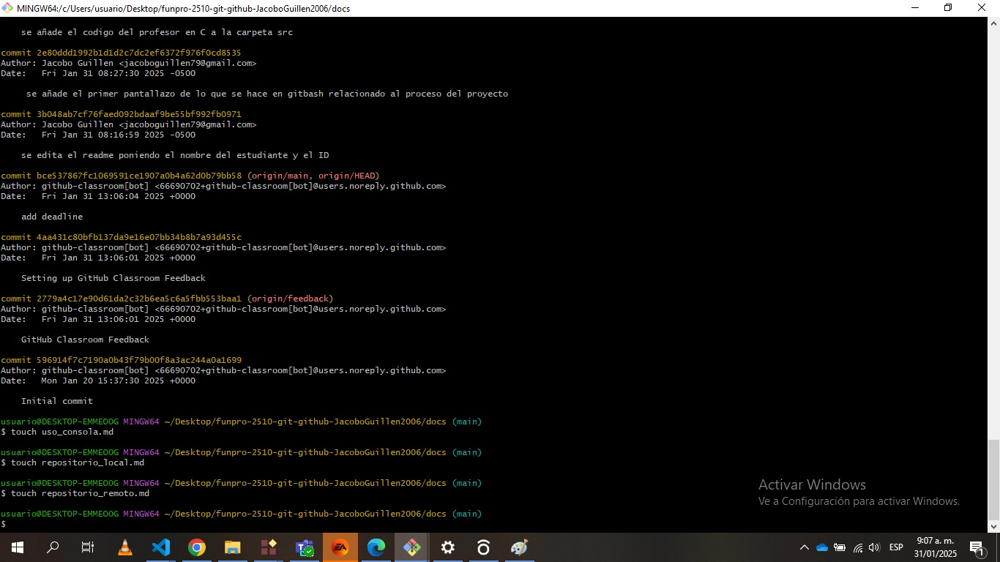

## uso de consola

para crear directorios y archivos con los conceptos aprendidos es a pura base de git, todo se puede hacer desde el visual studio, pero desde la consola de git podemos crear diferentes carpetas y archivos para el sistema en el que estamos trabajando


```
mkdir "nombre del archivo"
```
se usa "mkdir" para crear una carpeta en el repositorio

```
touch "nombre del archivo"
```

con "touch" podemos crear un archivo dentro de la carpeta

```
cd . y cd "nombre de carpeta"
```
con "cd "nombre de carpeta" " podemos entrar a la carpeta que queramos y con "cd" podemos salir de la carpeta en la que actualmente estamos



